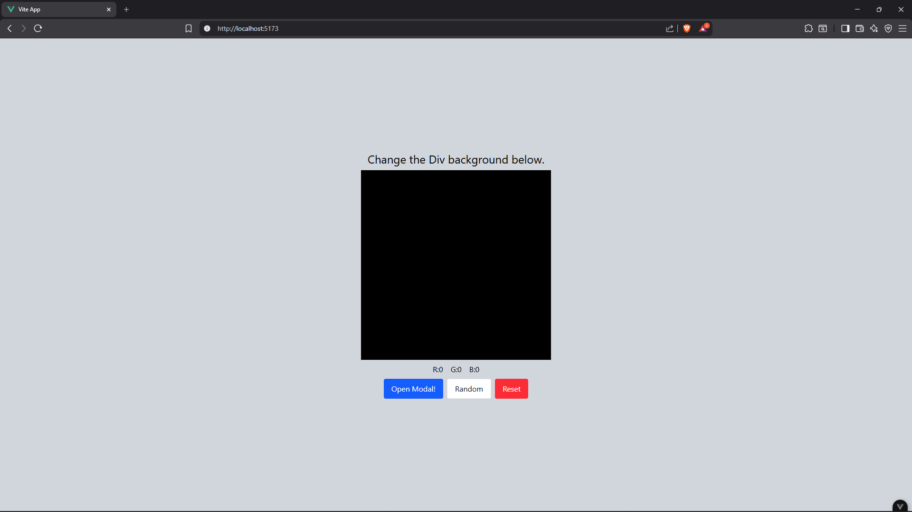
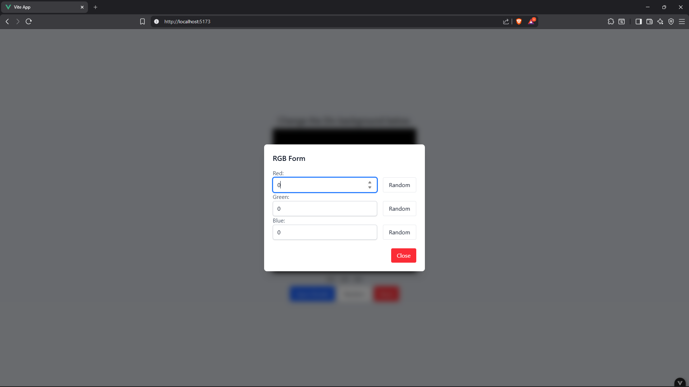
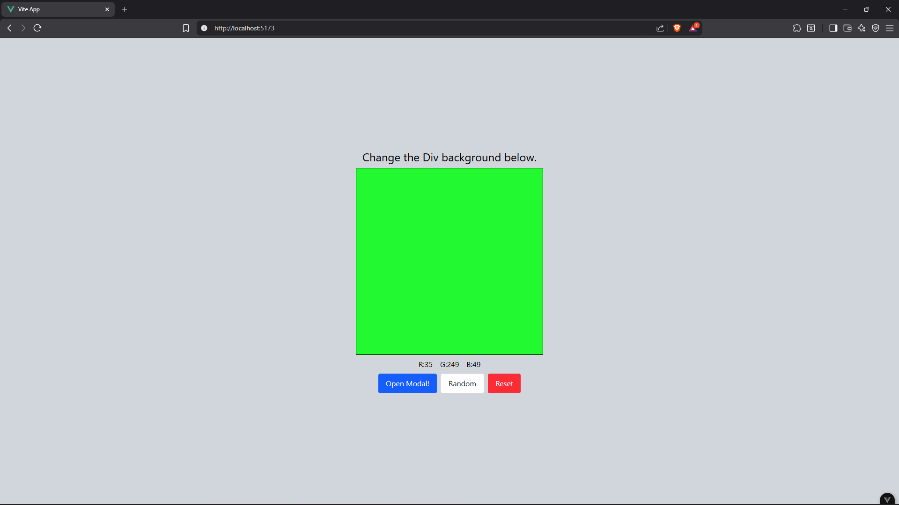
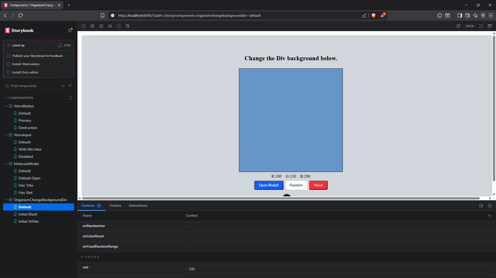
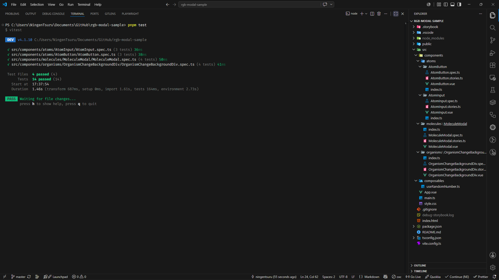

# RGB-MODAL-SAMPLE

# Step1

> This is the initial state of the project.

# Step2

> Clicking the Open Modal button displays a modal containing input fields for Red, Green, and Blue, each accompanied by a button to generate a random number between 0 and 255.

# Step3

> I've filled the input, and the color is changing behind it.

# Step4

> All components I've used are viewable in Storybook.

# Step5

> All components are tested, and here's the folder structure of the project.
